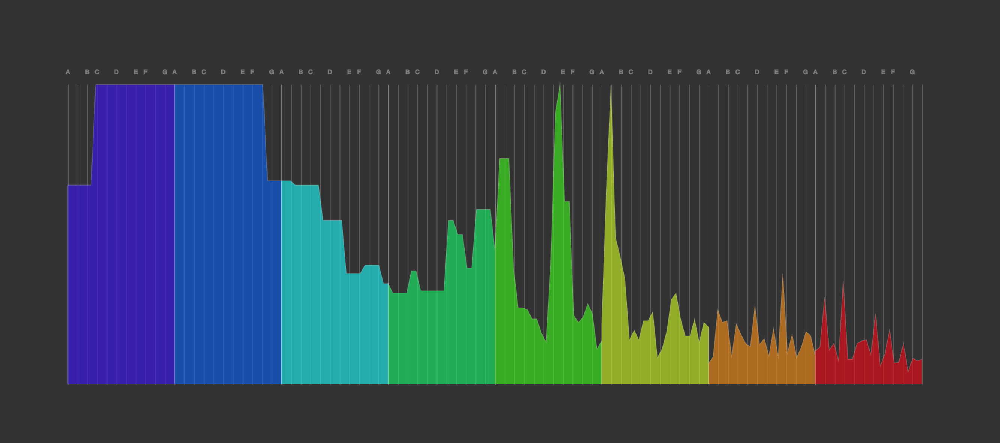
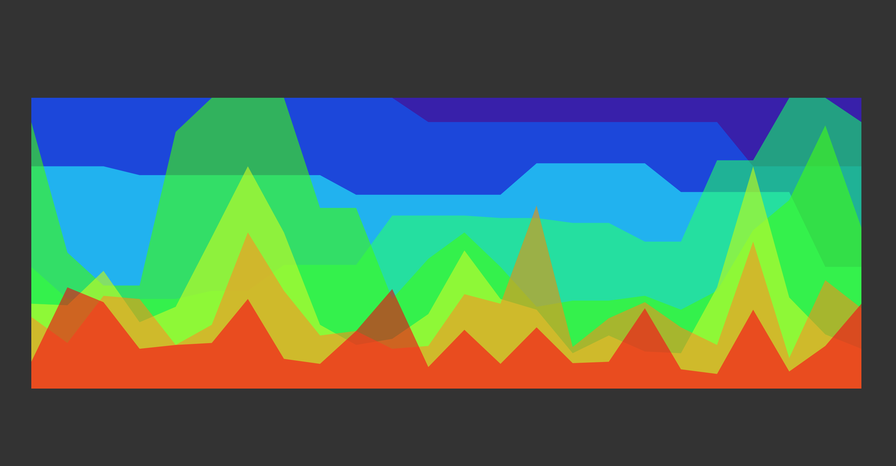

# Circle [[demo](https://ccorcos.github.io/circle/)]

This is an audio visualizer built with [p5.js](http://p5js.org/).

I was jamming with a buddy one day and I thought it would be really cool to know what key he was playing just by looking at a visualizer connected to a microphone in a room.

I realized that if I take the FFT of a signal and slice it up into concentric circles that line up with the notes of the diatonic scale, you can get a pretty nice representation of the noise in the room.

After playing around with various parameters, I realized that this was a pretty cool music visualizer and that's pretty much what you see now. You can tweak various parameters in the sidebar:

- you can toggle the mode between song / microphone.
- you can toggle the view between polar and linear.
- you can toggle whether the octaves overlap or are spread out.
- you can toggle the grid that displays the notes.
- you can change the sharpness of the amplitude.
- you can change the gain.
- you can change the color scheme&mdash;the colors are deterines by anchoring a hue and sweeping through HSL for each octave.
- you can edit the opacity of each layer.

One thing that can use improvement is the FFT granularity. I'm using the 2048 bit FFT out of the box, I think with a custom [script processor node](https://developer.mozilla.org/en-US/docs/Web/API/ScriptProcessorNode) you could probably build your own FFT that has much better granularity.

Here are some fun examples for you&mdash;click on the images to open up the visualizers with those presets.

